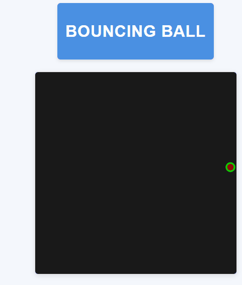

# Bouncing Ball

Um projeto simples e interativo desenvolvido com p5.js que simula uma bola quicando nas bordas da tela.

## Descrição

Este projeto consiste em uma animação de uma bola que se move e quica nas bordas da tela. A bola inicia seu movimento do centro da tela com uma velocidade aleatória.

  

## Características

- Movimento suave e contínuo
- Colisão com as bordas da tela
- Velocidade aleatória inicial

## Tecnologias Utilizadas

- HTML5
- JavaScript
- p5.js (versão 1.9.0)
- CSS

## Como Executar

1. Clone este repositório
2. Abra o arquivo `index.html` em um navegador web moderno
3. A animação iniciará automaticamente

## Estrutura do Projeto
